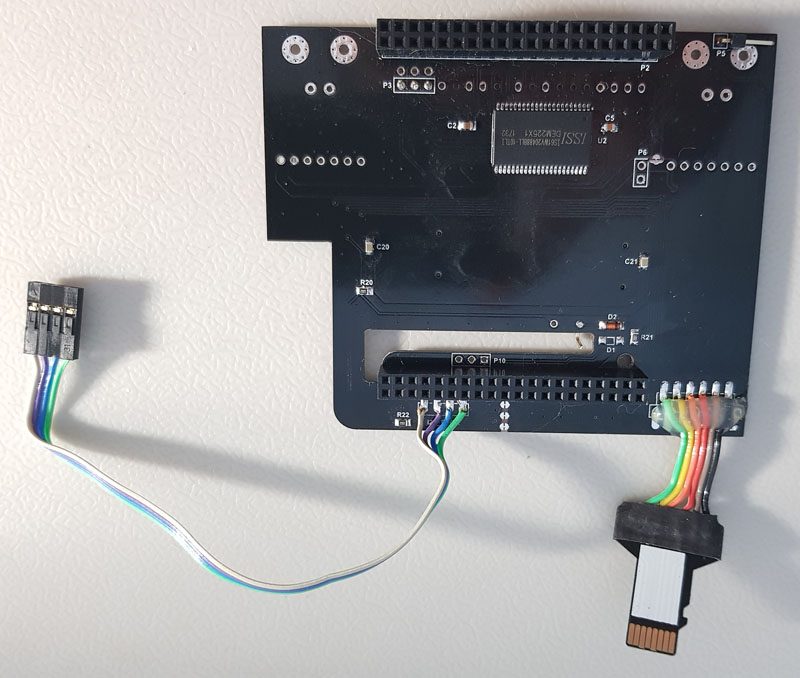
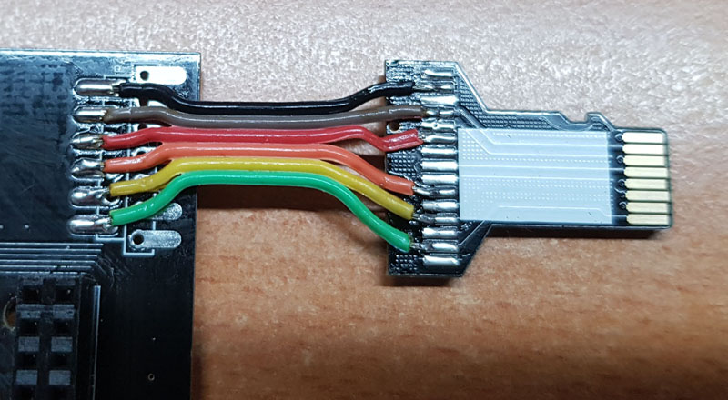
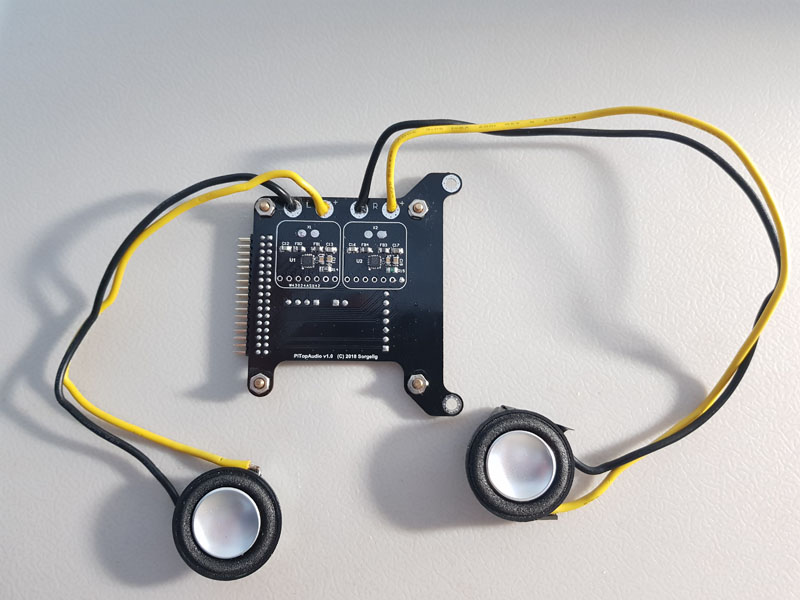
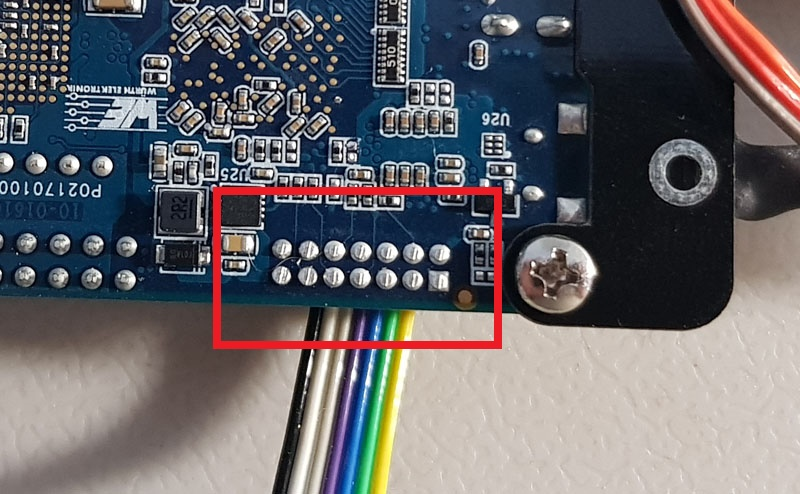
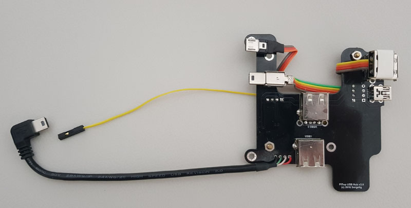
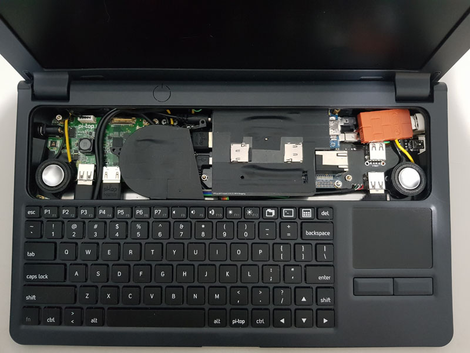
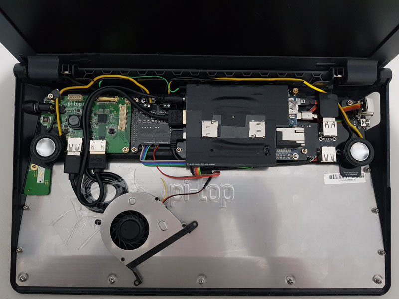
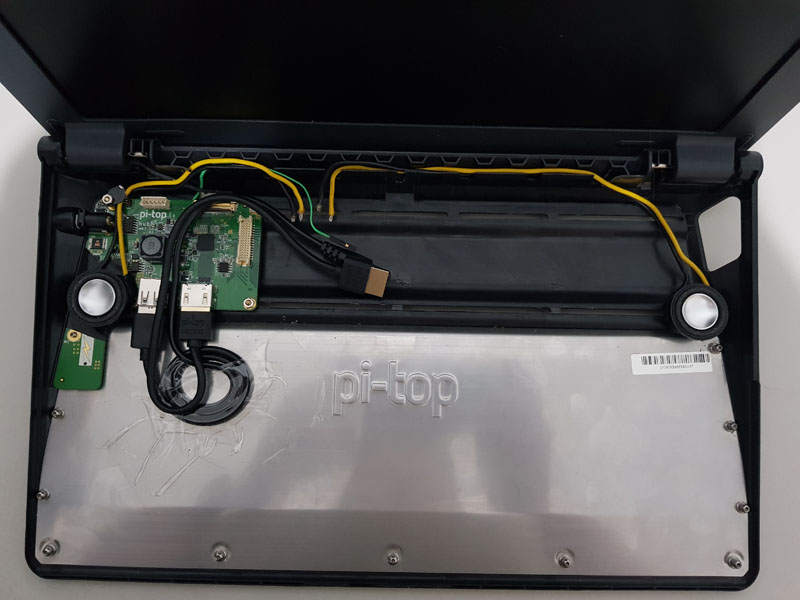
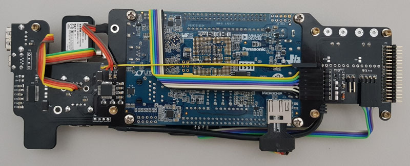
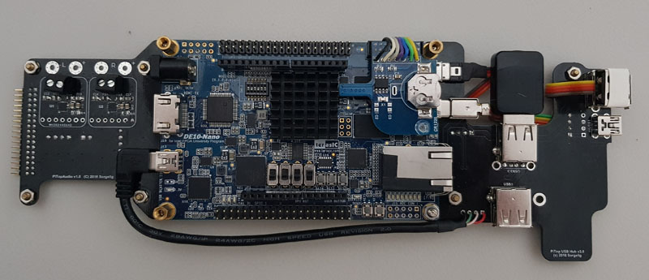

This is an attempt to put MiSTer into Pi-Top v1 (original) case and make a MiSTer notebook.

### Main note:
v1 case is discontinued by manufacturer. It just disappeared from the site. This case is still available from distributors such as RS-Online, Sparkfun, but won't last long. So, hurry up if you want to put MiSTer into this case! You may buy it even if you are not sure. You still can use this case for RPi/TB in case if you will change your mind.

### This is not a budget case.
Case is pretty expensive but the only solution on the market. High price of the case doesn't mean good quality, alas. Plastic used on the case is so-so. Connections between plastic details aren't good either. Be careful as some parts are easy to brake (although pi-top site is full of pictures with children). Overall it looks like cheap case, but as has been said, there is no other option on the market to make your own notebook. 

You can think about adaptation of some (old) notebook case. But it will be more hard and possibly even more expensive. Notebook displays usually have either LVDS or eDP interface while Pi-Top has HDMI. So you will need to find/make a conversion board for notebook display which is not always possible. Keyboard and touchpad in traditional notebook have "naked" interfaces providing low-level connection while Pi-Top provides USB connection for both keyboard and touchpad. So you will need to make another conversion board for keyboard and touchpad on traditional notebook. Battery management on traditional notebook is on main board, so another board is required while Pi-Top provides integrated HUB board to manage the battery and display power control. So, adaptation of traditional notebook will require pretty large board to convert internal interfaces to those compatible with MiSTer(DE10-nano). Different notebooks have different internals, so it's impossible to make a one board for all notebook cases. And usually even in old thick notebooks there is no much space to fit DE10-nano - especially in height dimension.

So, after judge all these difficulties, the only viable option is Pi-Top case.

### There are 2 versions of Pi-Top cases.
This project is targeted to v1 (called as original on Pi-Top site) case only. This version has more space inside and has no specific to RPi holes and places. So, we have pretty relaxed placement of DE10-nano inside. Semi-transparent cover gives good view to all DE10-nano LEDs and doesn't require to drill the holes. v1 uses railed holes to fix the boards, while v2 case uses magnet rails not suitable for this project.

Probably it's possible to use v2 case as well, but it will require completely different add-on boards. 

v2 is available only in childish acid green color which is a main distraction point.

### You need to be very careful while messing with internals.
* There is high voltage on HUB board and its connector. It's highly advised to de-solder and remove pin 1 from PiTopHUB connector.

It delivers 16.5V and very dangerous for DE10-nano. There is no usage of 16.5V so it's better to remove this pin. Connector on PiTopHUB isn't shrouded and it's very easy to shift it while connecting and fry everything!
* Many parts on PiTopHUB are powered even when main power of Pi-Top is turned off. It's result of bad Pi-Top design. So, you need to be careful. Don't drop any metallic parts on the board. Avoid to touch the board.

### Buggy MCU firmware.
While developing the boards for Pi-Top i found it's easy to make MCU on PiTopHUB to stick in non-responsible state. And since MCU is always powered (even in power off state) power cycle isn't enough. There are 2 ways to reset the MCU.
1. Remove PiTopHUB and effectively remove the power from MCU.
2. Carefully short the two lower pins on tiny 6-pin connector - this is reset of MCU.

### New releases required.
New releases of Linux, MiSTer binary and Cores are required. Releases after March 02 2018 will be compatible with Pi-Top. 
Display of Pi-Top supports only one resolution - 1920x1080. So every core will require to support this resolution.

### Butter-smooth video
Although Pi-Top display supports only single resolution, it accepts any (reasonable) pixel clock and refresh rate. So, with this display and automatic VSync adjust option video may have original retro system refresh rate. All scrollers will be very smooth.

## Required Boards
Gerber and PDF files for all boards can be found [here](https://github.com/MiSTer-devel/Hardware_MiSTer/tree/master/releases)

### [Main Board](https://github.com/MiSTer-devel/Hardware_MiSTer/tree/master/Addons/PiTopAIO) ([Order on PCBWay](https://www.pcbway.com/project/shareproject/W43024ASU45_PiTopAIO_1_1.html))

This board has all important parts such as memory, both SD cards and Audio. 

### Memory
Both SDRAM (32MB) and SRAM (2MB) are on this board, although SRAM is not supported by any core. There are no plans to use SRAM in foreseen future, so it's advised not to solder SRAM and save the cost.
### SD Cards
Board has the same secondary SD card as on original MiSTer board. Another SD card is original DE10-nano card through micro-SD extender providing convenient access to card as original is in hard to reach place.

### Audio
Audio amplifiers may be soldered directly on board by components, or using [Adafruit audio breakout boards](https://www.adafruit.com/product/3006) by soldering connectors points. MAX98357A has very tiny pads - if you are not sure in your soldering capability, use the breakout boards. The price is about the same as set of components.
Although board has places for audio amplifier, it's advised not to solder it. Audio amplifiers gives up to 3.2W per channel and may draw up to 1.2A from 5V source. Due to audio nature, the draw will not be constant and will hammer the DE10-nano power circuit. So, it's advised to solder audio amplifiers on separate Audio board. 
By default 5V power of audio is connected to 5V of DE10-nano. There is an option to use external 5V supply for audio by cutting tiny cut point near P6 connector and connect external 5V (take from Audio board) source to unload internal DE10-nano power circuit.

### Notes
Due to height limit in Pi-Top case, this board is mounted at some angle. P1 uses standard profile connector while P2 uses high profile connector (same as on standard MiSTer I/O Board). Thus one side of Arduino connector will slightly protrude from this board's cutout while other side will be covered by the board. You need to cut pins on both connectors at the board level before soldering to make sure it won't prevent closing of sliding cover. (pictures are coming)
P4(primary card extender) and I2S_FPGA (if you use audio board) are better to be soldered as SMD using exposed pads on the bottom of the board for the same reason.(pictures are coming)

Recommended board thickness is **1.2mm**. This board thickness is included to total height of the whole construction.

### [Audio Board](https://github.com/MiSTer-devel/Hardware_MiSTer/tree/master/Addons/PiTopAudio) ([Order on PCBWay](https://www.pcbway.com/project/shareproject/W43024ASU46_PiTopAudio_1_1.html))

Using sockets for speakers:

Directly wired:

Audio amplifiers can be soldered directly on board by components, or using [Adafruit audio breakout boards](https://www.adafruit.com/product/3006) by soldering connectors points. MAX98357A has very tiny pads - if you are not sure in your soldering capability, use the breakout boards. The price is about the same as set of components.

Set on-board DE10-nano switches according to picture to enable I2S output to audio board:

Besides audio amplifiers, the boards are providing I2C and SPI connections to DE10-nano (through RTC board). I2C is used for battery monitoring. SPI is used for display brightness control. It's also providing power for fan. Fan power circuit has flexible way to adjust the power using diodes and resistors (see schematics).

Recommended board thickness is **1.0mm**. This board thickness is included to total height of the whole construction.

### [RTC Board](https://github.com/MiSTer-devel/Hardware_MiSTer/tree/master/Addons/RTC) ([Order on PCBWay](https://www.pcbway.com/project/shareproject/W43024ASU40_rtc_1_3.html))

RTC v1.3(or higher) is required to provide I2C and SPI connections. You don't need to populate the board if RTC is not required. You may connect I2C/SPI directly to DE10-nano without RTC board using 14-pin cable connector - just follow the RTC schematics.

It's better to trim connector pins on the bottom of DE10-nano board to prevent the cable puncture:

Recommended board thickness is **1.6mm**

### [USB HUB Board](https://github.com/MiSTer-devel/Hardware_MiSTer/tree/master/Addons/PiTopUSBHub) ([Order v2 on PCBWay](https://www.pcbway.com/project/shareproject/PiTop_USB_Hub_v2_0_for_MiSTer.html)) ([Order v3 on PCBWay](https://www.pcbway.com/project/shareproject/PiTop_USB_Hub_v3_0_for_MiSTer.html))
You may solder dual USB2-3 socket directly to the board, or (as shown on pictures) solder single socket with other socked hanging on wires to fit some larger USB device (such as 8BitDo receiver) inside.

This board provides convenient USB device connections - both internal(3xUSB) and external(1xUSB). Board also provides mini-USB pass-through for console (or USB Blaster if required).
This is optional board. You may use any tiny USB HUB to connect devices as you like.

There are 2 versions:
* v2 - based on 2 FE1.1S chips. This version is enough for most users. SSOP28 chips are relatively easy to align and solder.
* v3 - based on FE1.1 (periphery hub) and FE1.1S (Console+Blaster). FE1.1 is MTT USB hub providing high performance for mixed usage when both slow devices like keyboard/gamepad and high performance devices like WiFi or USB storage connected at the same time. FE1.1 uses LQFP48 package which is harder to align and solder.

Both versions have 2 Hubs on board. If you are not actively developing FPGA cores, then most likely you don't need to solder the hub on U2 chip. Only solder the hub based on U1 chip and then mUSB1 and the miniUSB "tail" to P2.

Recommended board thickness is **1.0mm**. This board thickness is included to total height of the whole construction.

## LEDs
Pi-Top v1 case has large semi-transparent door, so any lights will be visible through. Thus LEDs on DE10-nano are used for indications. Main Board provides the power LED.

## Buttons
Use keyboard to simulate OSD(F12), User(LCtrl-LAlt-RAlt) and Reset(LShift-LCtrl-LAlt-RAlt) buttons. 

It's possible to use hardware reset button by short press of power button but it requires hardware modifications of DE10-nano. 

## Power button.
Pi-Top power button requires about 2 seconds hold to turn the power on/off. If brightness has been changed since power on, then power button requires around 3-4 seconds hold to turn the power off.

## Cooling
Cooling is necessary as the space around the main chip is to small for passive cooling! The construction uses the turbine fan. It takes air from bottom of the case (remove one magnetic plate on the bottom for air flow)

and blows to the side under AIO board all the way to hole on the right of PiTop case. It's hard to screw the fan. There are many different fans on the market. Currently used fan just lays unattached - surrounded parts just keep the fan in place.

## More pictures

You need to buy USB-to-barrel short cable to connect the power to DE10-nano board.

Optionally AIO board can be covered by black tape for additional protection.

AIO board detached:

Unused ADC header has been removed from DE10-nano to improve LEDs view. Black tape attached to Ethernet connector is to reduce glow effect.

# Bonus: v2 consideration

This is how bare DE10-nano fits inside v2 case:

Cover cannot be closed. Board doesn't fit. Picture shows the maximum closed position of the cover. Probably, after removing the metallic rail road and cutting the plastic ribs, DE10-nano will be able to fit. So, irreversible modification of the case will be required with drilling the holes.
Most likely it's possible to use the same AIO and Audio boards. It will require other USB hub board to accommodate RPi holes on the back of the case.

Height comparison v1 vs v2:

Basically, v2 is a little slimmer on the back and a little thicker on the front. But without side-by-side comparison it's hard to notice the differences.

Overall comparison of v2 to v1:
* (-) Only green color available.
* (+) Slightly better tactile feeling of the case. It's not so slippery as v1.
* (+) Wider keyboard and bigger touchpad.
* (-) Cannot fit DE10-nano without butchering the case.
* (-) Non transparent cover. Cannot see any indication from the board.
* (-) Almost no holes (v1 has big holes around hinges), everything is tightly coupled -> needs to drill the holes for speakers.

Conclusion: use v2 for Raspberry Pi or Asus Tinker Board ;)
