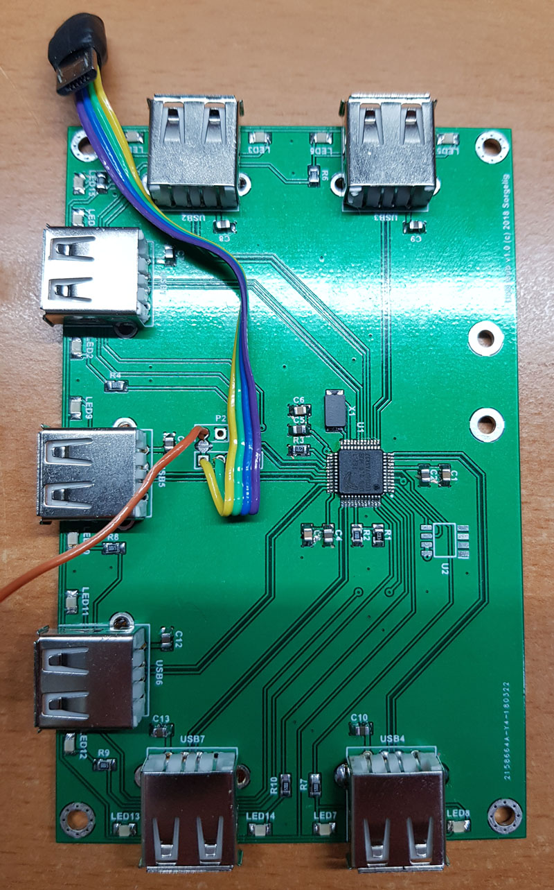
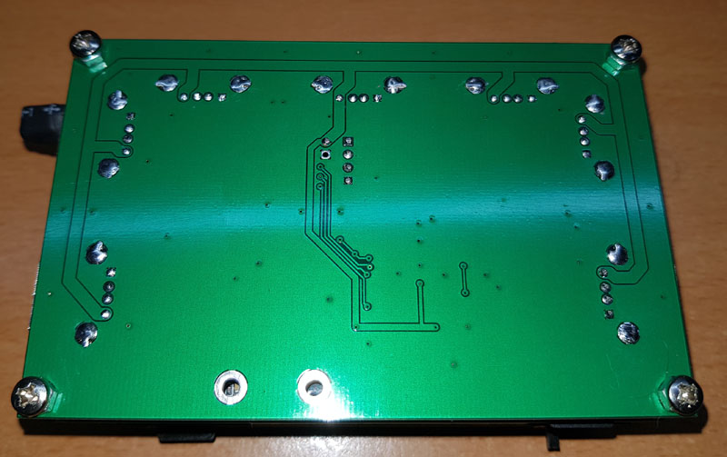
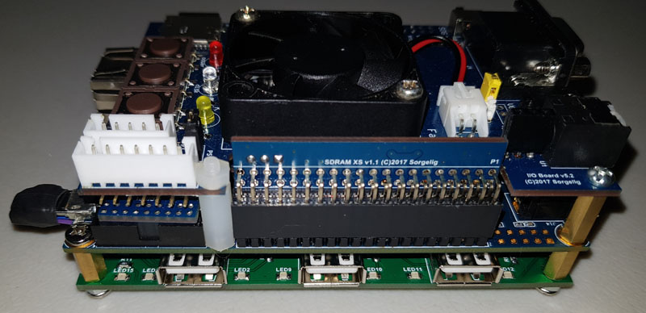
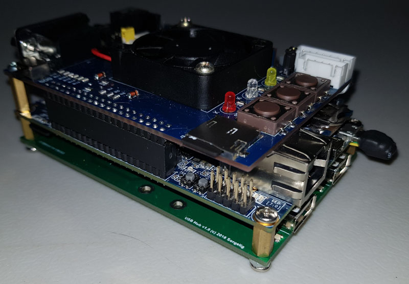
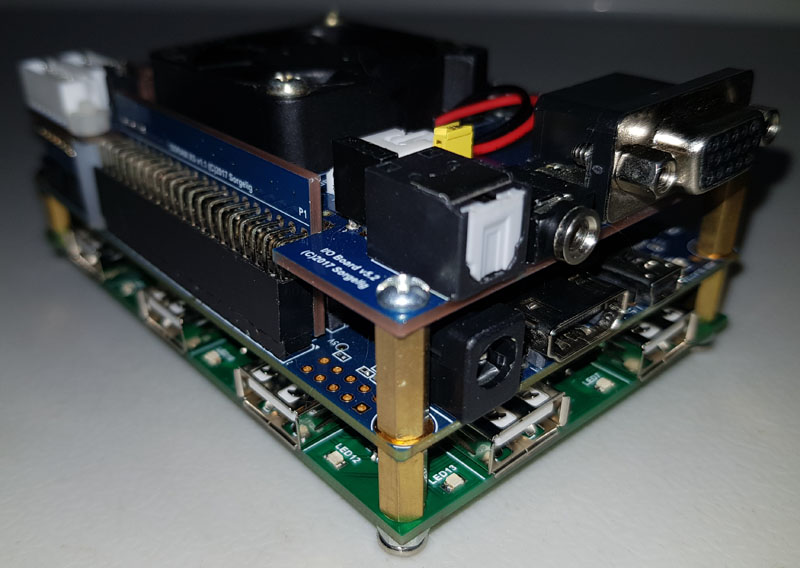
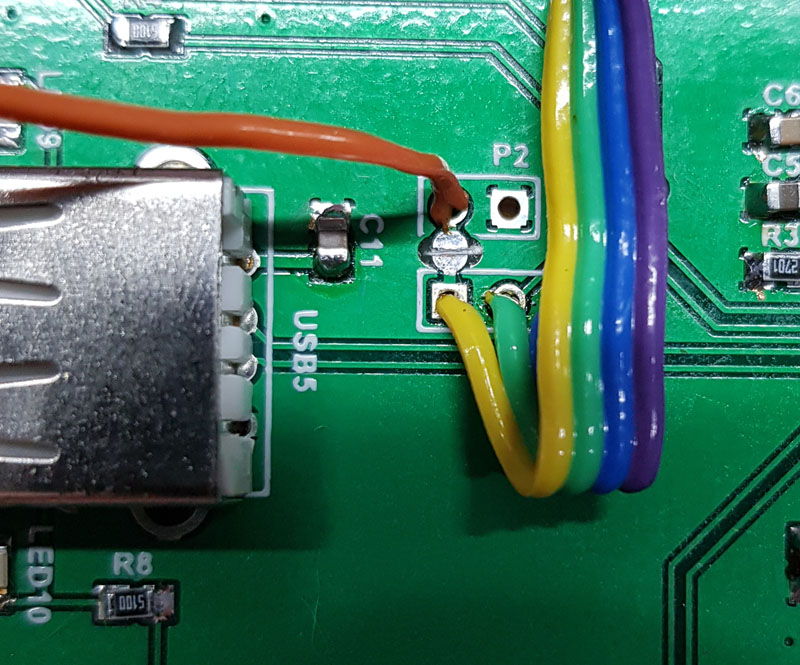

This is an optional add-on usb hub pcb made for convenient USB device connections. 
With this board the MiSTer has an extra seven USB ports that fit snugly under the existing chassis.

[Order v1.2 PCB on PCBWay](https://www.pcbway.com/project/shareproject/USB_Hub_v1_2_for_MiSTer.html)

[Order USB Bridge board PCB on PCBWay](https://www.pcbway.com/project/shareproject/USB_Bridge_board_for_MiSTer.html)

The Hub is based on the FE2.1 chip, which requires only a few external components. It uses 3 sides for USB sockets. Since the input Micro-USB connector has a flexible wired connection to the board, the user can mount it in either direction to choose the side providing the USB connections.

The Hub add-on board allows you to use power from Micro-USB or external power. 
External power is preferred as this will prevent USB over-current triggering. 
In case external power is used, a small cut point (shown on picture) should be cut (or you can leave the Micro-USB +5V wire unsoldered)!

